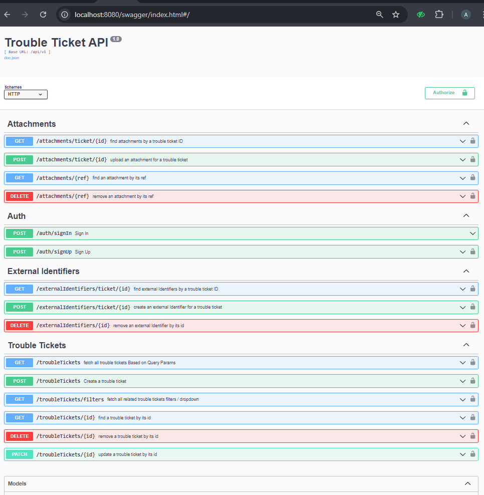

# Trouble Ticket

Trouble Ticket API

go-restapi-mysql-keycloak-redis-docker

## Dependencies
- [Go](https://github.com/golang/go)
- [Gin](https://github.com/gin-gonic/gin)
- [Go Cloak](https://github.com/Nerzal/gocloak)
- [Lumberjack Logger](https://github.com/natefinch/lumberjackLumberjack)
- [MySQL 8.4.2](https://hub.docker.com/_/mysql/Utilize)
- [Go Sql Driver](github.com/go-sql-driver/mysql )
- [Gorm](https://github.com/go-gorm/gorm)
- [Go-redis](https://github.com/redis/go-redis)
- [Ginkgo](https://github.com/onsi/ginkgo)
- [Cors](github.com/gin-contrib/cors)
- [GoDotEnv](github.com/joho/godotenv)
- [Gin Swagger](https://github.com/swaggo/gin-swagger)

## Getting Started

### Prerequisites

- Go 1.22 or higher
- Docker (optional, for running MySQL and Redis)
- MySQL server
- Redis server

### Installation

1. **Clone the Repository**

    ```bash
    git clone https://github.com/bannaarr01/trouble-ticket-ms.git
    cd trouble-ticket-ms
    ```

2. **Configuration**

    - Update all the `env` files for database and Keycloak.


3. **Start the Application**

    ```bash
    docker-compose up -d
    ```

### API Endpoints

Refer to the [Swagger Documentation](http://localhost:8080/swagger/index.html) for detailed information on available endpoints and their usage.



### DB Design
[DB Structure](assets/db_structure.pdf)

### Testing

To run the unit tests:

```bash
ginkgo ./... 
```

### Note
Note: To ensure successful signup via keycloak endpoint, needs to update few settings on keycloak for new account
Or you can just import this [realm settings](realm-export.json)

### Keycloak
Refer to the [Keycloak Admin Console](http://localhost:8501) to manage/create new realm and proceed with other setup such as Realm roles, client etc.

### Stay in touch
- Author - [B. Joshua Adedigba](https://www.linkedin.com/in/b-joshua-adedigba-a96231211/)
- Email: [joshuaboluwaji6@gmail.com](joshuaboluwaji6@gmail.com)
